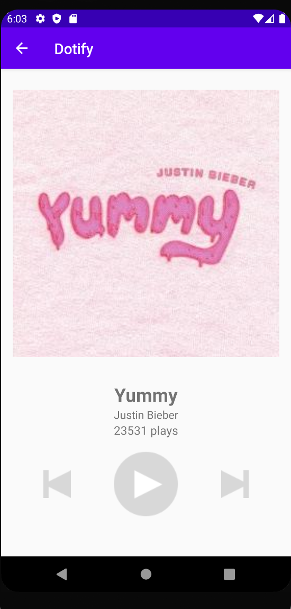
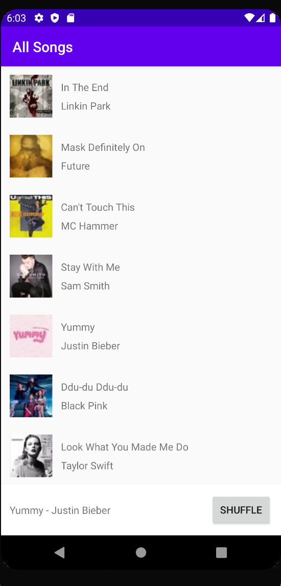
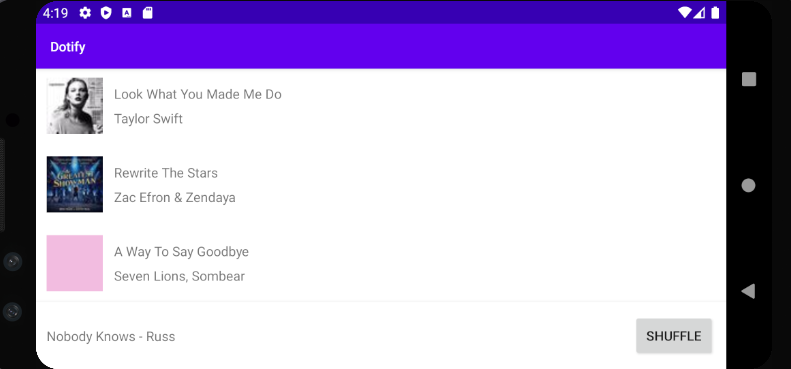
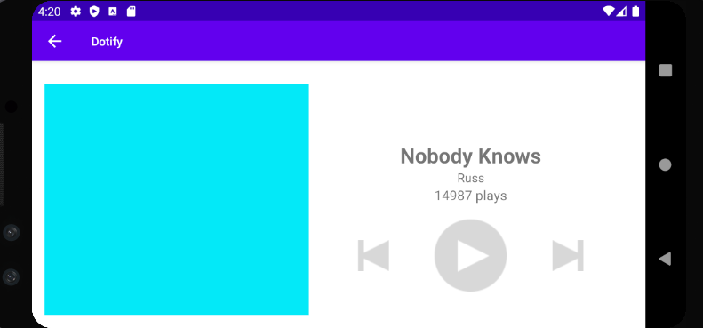

# Dotify by Ashmann Syngle

This app shows a list of songs (with artists and cover photos) with a small mini player view. The user can click on a song to change the current song (in the mini player). The user can press 'Shuffle' to shuffle the songs in the list. They can also long press a song to delete it. On clicking the mini player, the user sees a screen which shows all information about the song as well as interact with the media buttons (play, previous, next). The user can also rotate the device at any instance and will have the same information displayed as before (and vice-versa).

## Extra credit - HW3
N/A

## Screenshots

## Installation & Usage
N/A 